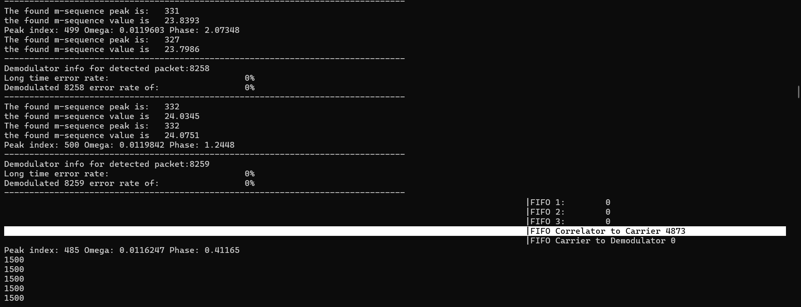
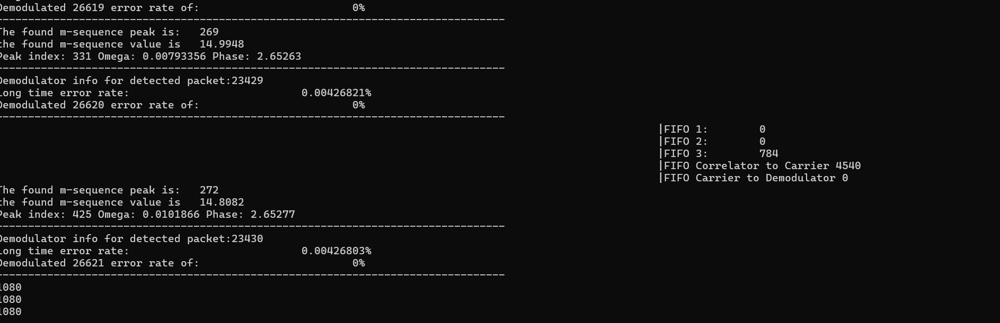
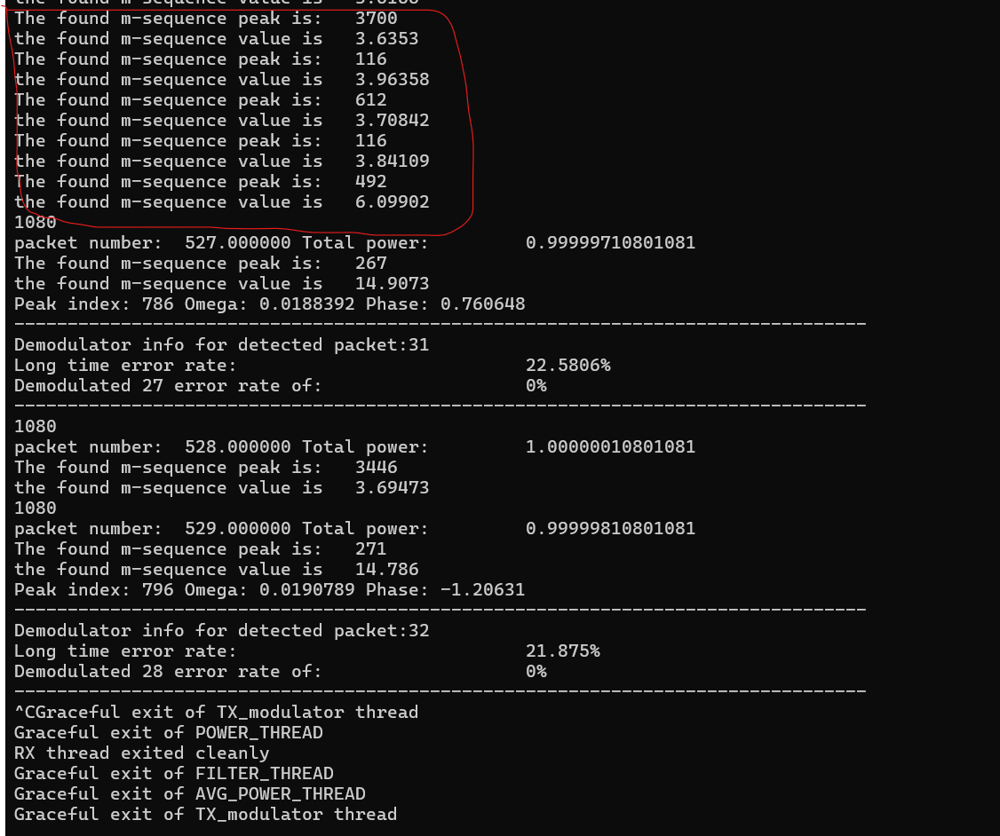

# Lab Report

## Introduction
This lab involves modifying an old TX and RX chain from DBPSK -> (BPSK and QPSK) - this requires a carrier frequency offset estimation. This estimation is to be performed with a one shot estimation which should be sufficient for the packatized system we have, and will be performed after the prior symbol timing estimation. A new demodulator and modulator will beed to be created for both BPSK and QPSK.

## Solution Approach
The main problem to solve in this lab is performing a ML estimator for CFO (omega and theta). This requires a careful selection of pilot symbol length, and FFT size as outlined in the readme. For this lab a selection of our pilot (m-sequence) length was 63, and a (very conservative) FFT size of 262144 was used. The FFT was performed on the received signal's m-sequence (whose start was found through prior symbol sycronization) multiplied by its known conjugates, and then padded with zeros for resolution. The peak of the FFT was found, and the associated index/frequency bin used as the ML omega estimate, and the phase of that bin treated as the theta estimate. This was then applied to the downsampled original signal and passed to the demodulator. This process worked for both BPSK and QPSK.

## Implementation
It should be noted that starting in this lab onwards pre-processor definitions/flags are added for debugging regions, thus code readibility is being sacraficed slightly for ease of debugging.  
 
Pre-processor flags/defintions are also leveraged for swapping between BPSK and QPSK, as buffer sizes vary dramatically and over-allocating is a waste of space 
<b>To swap beteen the two alter the passed -D flags in the Makefile</b> 

A software switch between TX and RX persist for this lab, which is activated by passing either a tx-rate or rx-rate parameter to the executable.

The modulator was altered to perform BPSK or QPSK modulation, and a new demodulator was created to support BPSK and QPSK demodulation 
 
Old modulator/producer TX threads were adjusted to match the new packet format, along with the new demodulator 

These threads were used for RX block capture and processing on the first radio;
- rx_thread; made recv calls and pushed blocks to data_fifo (numbering system is a relic)
- power_proc1 thread; Consumes data_fifo and pushes to data_fifo2 when loop filter passes threshold: has statemachine to capture all of a packet even if between blocks, and pushes packet number. This thread also now handles the AGC.
- power_proc2 thread; calculates and prints average packet energy by pulling from data_fifo2 : also tracks number of packets recieved. Pushes to data_to_match_filter
- filt_thread; Consumes data_to_match_filter, applies RRC filter of beta = 0.25 and U=8 D=1, pushes output to data_fifo3
- correlator_thread; consumes data_fifo3, performs single shot symbol syncronization estimates, pushes packets at symbol rate to Correlator_to_Carrier.
- carrier_sync_thread; consumes Correlator_to_Carrier and performs CFO estimates and applied them to packet, then pushes that to Correlator_to_Demodulator
- demodulator_thread; Performs demodulation and compares result with original known payload to find BER per packet, and to find long term packet error rate 

These threads were used for the TX chain on the second radio:

- producer_thread ; Generated the block of 125 random ints and pushed to data_fifo3
- modulator_thread; consumed data_fifo3 and converted the random ints to BPSK modulated std::complex<floats> and pushed to data_fifo2. This thread also rate limits FIFOs to prevent them from growing too large
-  filt_thread ; consumed data_fifo2 and applied RRC filter: then pushed output to data_fifo
-  file_gen_thread ; Takes first output from filter and outputs it to filename passed by executable. Otherwise passes data_fifo directly to data_fifo4
-  tx_thread ; consumes data_fifo4 and transmits a packet every second.
  Of note:  
The call to spawning the rx_thread/tx_thread not only returns the rx_thread/tx_thread, but also initializes the recieve/transmit chain.
This decision was made to not bloat the lab1.cpp file too much (Boost input handling already makes it long).   
 
A mention of main is also maybe neccessary; a thread does run checking the flag set for ctrl+c and joining threads when the flag is set

 
 
Finally, it should be noted that care for output of thread termination to std::cout wasn't handled with a shared printer - this is info logging that I would just remove if I didn't plant to expand on this code; the same is true for other utility logging that I want to forward into lab5

## Results
1.)  
To run generated output from makefile a structure similar to this should be used for RX (May need to delete the "\"s depending on use case): 
./lab1 --rx-args="addr=192.168.10.2" \        --rx-rate=1e6 \        --rx-freq=2437e6 \        --rx-gain=15 \        --rx-ant=RX2 \        --sblocks=10000 \        --file="no"
 

To run generated output from makefile a structure similar to this should be used for TX: 
./lab1 --tx-args="addr=192.168.10.2" \        --tx-rate=1e6 \        --tx-freq=2437e6 \        --tx-gain=15 \        --tx-ant=TX/RX \        --sblocks=1000 \        --file="no"
 

 <b>To keep accurate packet tracking it is semi-important to actually start the RX thread before the TX thread from this lab onwards  </b>
By performing this sequence of commands in the right order on the wireless connection and waiting for a while, it can be found that a BER for each transmitted packet was zero: a long term packet error rate was zero. Re-compiling and performing the same sequence of commands with QPSK yeilds identical results 
 
 
The wired connection is similar with a 0% BER and 0% long term packet error rate since zero erronous packets are detected by the energy detector due to the nature of the wired channel.
 
The maximum found angle of drift was determined to be ~7 degrees over the full packet - this is clearly robust enough to support both BPSK and QPSK, providing the prior results as expected.
 

## More Results
Once again, a vast majority of "results" from this lab were found through sequential testing of each component and prototyping in a [jupyter notebook](../lab5.ipynb). The result of this are compiled in this notebok. It should be noted not all of them are completely up to date, as one or two parts may have been found to be in error, corrected in c++. and depreciated in python, but the notebook overall should show the general prototyping and decision making made throughout. The real major important results included and seen from a glaceover of this notebook are graphs showing the end corrected drift in the constellation plots for BPSK and QPSK, and just the initial modulation for BPSK and QPSK actually being correct. Most of the inbetween is debugging or personal re-assurance.

# More Experiments

 
By increasing the packet generation rate,the following observations were made (on the wired channel to prevent any collisions from external packets):  
1.)
For BPSK:
1 second generation rate: 0% packets missed. 
0.5 second generation rate: 0% packets missed. 
0.25 second generation rate: 0% packets missed. 
0.125 second generation rate: 0% packets missed. 
0.05 second generation rate: 0% packets missed. 
0.025 second generation rate: 0% packets missed. 
0.012 second generation rate: 0% packets missed. 
0.005 second generation rate: 0% packets missed. 
0.002 second generation rate: 0% packets missed - The RX FIFOs do grow and thus this setting can only be used for short burst, but it does capture all packets 
0.001 second generation rate: ~100% of packets missed - my energy detector starts to constantly go off and seems to chop packets in half when storing them, which I'm counting as missing) 

 
Below shows the FIFO's growing to unreasonable sizes with the 0.002 second generation rate: 

  2.) 
For QPSK:
1 second generation rate: 0% packets missed. 
0.5 second generation rate: 0% packets missed. 
0.25 second generation rate: 0% packets missed. 
0.125 second generation rate: 0% packets missed. 
0.05 second generation rate: 0% packets missed. 
0.025 second generation rate: 0% packets missed. 
0.012 second generation rate: 0% packets missed. 
0.005 second generation rate: 0% packets missed. 
0.002 second generation rate: 0% packets missed - The RX FIFOs do grow and thus this setting can only be used for short burst, but it does capture all packets 
0.001 second generation rate: ~100% of packets missed - my energy detector starts to constantly go off and seems to chop packets in half when storing them, which I'm counting as missing) 

 
Below shows the FIFO's growing to unreasonable sizes - although seemingly fares better than BPSK - with the 0.002 second generation rate: 

  3.)
(wireless channel since it is more interesting)  
At the maximum sampling rate of a full 25 MHz with the 1 second packet generation rate I do not get under or overflow on either side, however my long term packet error % does increase to around 20% at this rate, and a much greater % of erronous/external packets shown by the highlighted red portion of bad ACQ correlation values.
 

If I decrease to 12.5 MHz with the same packet generation rate, I do seem to maintain a 0% long term error rate, however I start to miss packets - I assume I get greater energy detection threshold interference, and then I store massive blocks that contain only part of my actual packet. I would likely need to re-calibrate my energy detector thresholding to get this to go away. 
At 10Mhz I get the same behavior overall as 1 MHz. I may just also stop grabbing an adjacent busy channel at this bandwith. The same packet generation as prior works at this rate too, so I can get an active transmit symbol rate of 8 MSps, with a packet generation rate of 1 every 5 milliseconds (Obviously the effective symbol rate is more reliant on the packet generation rate here). I could likely up the packet generation rate by just decreasing my FFT size. 

4.) Comparing coherent vs. non-coherent: Overall the BER and packet error rates between the two are identical at lower sampling and packet generation rates, however non-coherent performs better in this system as the packet generation and sampling rate rises since coherent modulation takes more processing time to perform CFO estimation, thus when pushed to higher throughput, computing power doesn't keep up as well.

## Code Listing
NOT INCLUDED IN THIS LISTING IS UTILITY FUNCTIONS USED DIRECTLY FROM GIVEN CODE: THESE INCLUDE THE GIVEN FIFO AND SHARED_PRINTER 
 Those can however still be found in the src directory
  For conciseness I am not including some general defines and headers, but some other important global defines can be found in [Utility](../src/utility)
  It should also be noted at this point for debugging the passed linker flags do include debugging options, and the production code should be compiled
without any passed debugger flags in the Makefile (It may need to be edited)
- [AVG_POWER_THREAD.cpp](../src/AVG_POWER_THREAD.cpp)
- [AVG_POWER_THREAD.h](../src/AVG_POWER_THREAD.h)
- [multi_filter.cpp](../src/multi_filter.cpp)
- [multi_filter.h](../src/multi_filter.h)
- [Correlator.cpp](../src/Correlator.cpp)
- [Correlator.h](../src/Correlator.h)
- [Demodulator.cpp](../src/Demodulator.cpp)    --Depreciated: old DBPSK demodulator
- [Demodulator.h](../src/Demodulator.h)        --Depreciated: old DBPSK demodulator
- [Coherent_demodulator.cpp](../src/Coherent_demodulator.cpp)   
- [Coherent_demodulator.h](../src/Coherent_demodulator.h)
- [Carrier_sync.cpp](../src/Carrier_sync.cpp) 
- [Carrier_sync.h](../src/Carrier_sync.h) 
- [POWER_THREAD.cpp](../src/POWER_THREAD.cpp)
- [POWER_THREAD.h](../src/POWER_THREAD.h)
- [impulse.h](../src/impulse.h)
- [RX.cpp](../src/RX.cpp)
- [RX.h](../src/RX.h)
- [lab1.h](../src/lab1.h)
- [lab1.cpp](../src/lab1.cpp)
- [TX.cpp](../src/TX.cpp)
- [TX.h](../src/TX.h)
- [file_gen.h](../src/file_gen.h)
- [file_gen.cpp](../src/file_gen.cpp)
- [TX_modulator.h](../src/TX_modulator.h)
- [TX_modulator.cpp](../src/TX_modulator.cpp)
- [TX_producer.h](../src/TX_producer.h)
- [TX_producer.cpp](../src/TX_producer.cpp)
- [impulse.h](../src/impulse.h)
- [impulse.cpp](../src/impulse.cpp)
